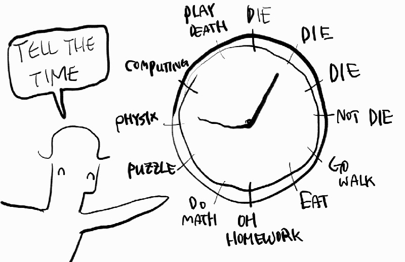

---
# Feel free to add content and custom Front Matter to this file.
# To modify the layout, see https://jekyllrb.com/docs/themes/#overriding-theme-defaults

layout: default
title: "Welcome to My Blog"
---

Hi I'm currently physics major at university in South Korea. One reason I made here was making an archive of mine(and the other is just for studying, recording, and surfing). My native language is Korean so I'm planning to translate some of my notes from my private blog to here. 

Main interests: 

1. Physics, Art theory \| home base. Additional tags [tag_link] are below:
- Classical Mechanics and Relativity
- Electrodynamics [ED](./ED/ED_content.html)
- Quantum Mechanics [QM](./QM/QM_content.html)
- Thermal and Statistical Physics [TSP](./TSP/TSP_content.html)
- Quantum Field Theory [QFT](./QFT/QFT_content.html)
- Solid State Physics [SP](./SP/SP_content.html)
- Mathematical Physics [MP](./MP/MP_content.html)
- Computational Physics [CP](./CP/CP_content.html)
- Some art portfolios [BP](./BP/BP_content.html)

2. Philosophy, language \| second base
- Philosophy [P](./P/P_content.html)

3. Tactics, music theory, riddle | simple curiosities
- Art Theory and Riddles [R](./R/R_content.html)

4. Cubing, SF, spooky tales, other play \| experimental mind.